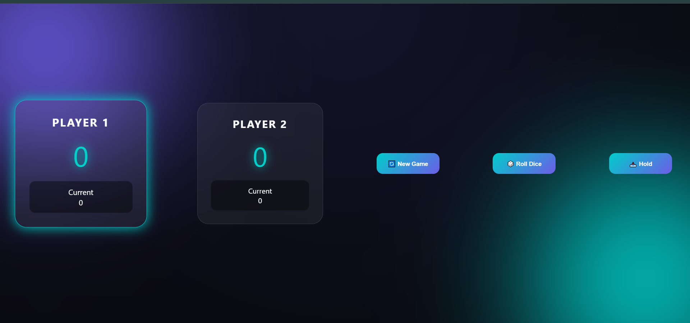

# 🎲 Roll A Dice

A modern and interactive dice game built with **HTML, CSS, and JavaScript**.

Roll the dice, collect your score, and challenge your opponent.  
A simple but addictive game project created to practice JavaScript logic and DOM manipulation.

## 🚀 Live Demo

https://ehsanellahi1385-commits.github.io/Roll-a-dice/

## ✨ Features

- 🎲 Random dice rolling system
- 👥 Two-player gameplay
- 🔄 New game reset
- 📥 Hold score functionality
- 🏆 Winner detection
- 🎨 Modern glassmorphism UI
- ⚡ Smooth animations and transitions

## 🛠️ Built With

- HTML5
- CSS3
- JavaScript (ES6)

## 📂 Project Structure
